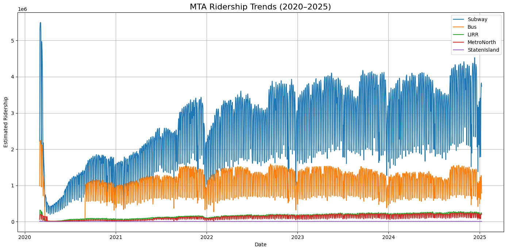
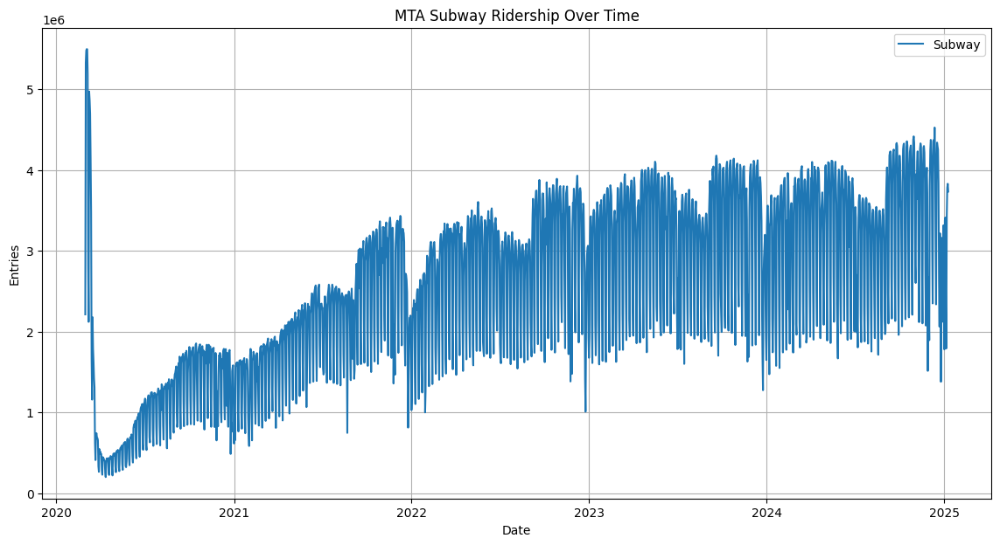

# MTA Ridership Analysis
## Introduction
For this project, we used the MTA daily ridership from 2020-2025 (https://catalog.data.gov/dataset/mta-daily-ridership-data-beginning-2020). Using ARIMA or Prophet model, we were be able to predict the ridership on specific days, and also analyze the recovery rate of each transportation mode after COVID-19 lockdown. Then, we predicted the maximum recovery rate over the next 10 years.

## The Dataset
Source: https://catalog.data.gov/dataset/mta-daily-ridership-data-beginning-2020

Timeframe: 2020 - 2025

Columns Used:
- Date
- Subways: Total Estimated Ridership
- Buses: Total Estimated Ridership
- LIRR: Total Estimated Ridership
- Metro-North: Total Estimated Ridership
- Staten Island Railway: Total Estimated Ridership

## MTA Daily Ridership Data: 2020 - 2025


As we can see in the graph, there is a huge drop in ridership around the beginning of 2020. If we follow the trend of each transportation mode, we notice that the ridership gradually increases. The growth are noticable for all mode except Staten Island Railway due to higher volume of riderships of the other tranportations. Nevertheless, we included all modes in our analysis.


## MTA Subway Ridership


The MTA Subway has the largest ridership among all the transporation mode in NYC. Given the large data, we applied both ARIMA and Prophet models. ARIMA served as our initial learning model to forecasting while Prophet offered tools for visualizing trends and seasonality.

### ARIMA
We started with ARIMA because it's a classic baseline model for time series forecasting. This model is design to work for single variable time series data and capture trend and seasonality with differencing.

ARIMA has 3 variables:
1) AR (Auto-Regressive): uses past values as inputs in regression
2) I (Integrated): the data is stationary
3) MA (Moving Average): uses past errors as inputs in regression

Before fitting the model, we prepared subway's data by splitting into training and testing. And then,
from statsmodels.tsa.stattools import adfuller

```python
from statsmodels.tsa.stattools import adfuller

Run ADF test
result = adfuller(train['Subway'])

print('ADF Statistic:', result[0])
print('p-value:', result[1])
```

